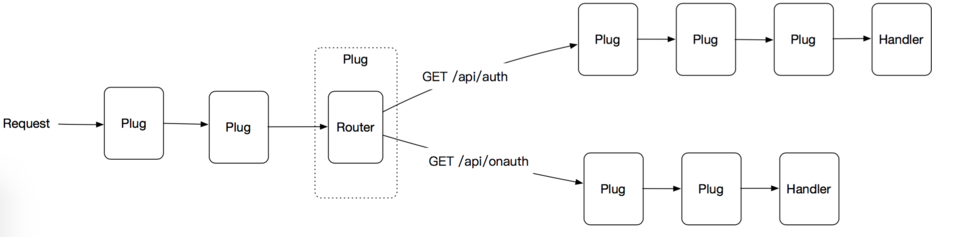

# xrest
JSON Restful API with context.Context in mind.

## Plug structure

### TODO
- [ ] add realtime plug (like phoenix channel)
- [ ] add docs
- [ ] add a project site (github pages)
- [ ] add a guide
- [ ] add session plug
- [ ] add more...
